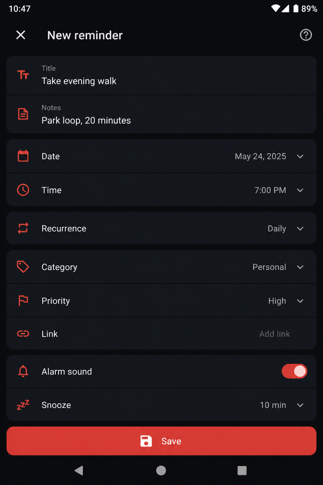

  

<h1 align="center">Ryuk Reminder</h1>

  <strong>Offline-first Android reminder app</strong> 
  Reminders, birthdays, countdown timer, and alarms that fire even when the phone is locked — no account, no cloud, no ads.

  
  
  

  
  
  
  
  

---

> **Repository notice**  
> Public product page + official APK only. **Source code is not open source.**  
> Developer hub: **[Ryuk-Dev](https://github.com/heema2/Ryuk-Dev)**

---

## What is Ryuk Reminder?

Ryuk Reminder is a **Kotlin / Jetpack Compose** Android app for people who want alarms that actually fire — without an account, cloud, or ads.

| | Feature |
|---|---|
| Reminders | One-time and recurring (daily, weekly, monthly, yearly, custom) |
| Birthdays | Eve alert (09:00) + **midnight** birthday alert (00:00 local) with Happy Birthday sound |
| Languages | **English** and **Arabic** (RTL) — switch anytime in Settings |
| Organize | Categories, priorities, search, and filters |
| Alerts | Sound, vibration, **Complete** / **Snooze**, and screen wake on lock screen |
| Timer | Countdown timer with presets, Pause / Stop live notification, **Silence** when done |
| Simulation | Preview reminder, timer, and birthday notifications from Settings |
| Themes | Light, dark, and system |
| Privacy | Works **fully offline** (no internet permission) |

---

## What's new in v2.0.1

### Critical fix
- **Birthday day notification now fires at local midnight (00:00:00)** — not 9:00 AM
- Eve (“1 day left…”) alert still fires at **09:00** the day before

### Localization
- Full **English + Arabic** UI and notifications
- Language picker in **Settings** (English default; العربية available)
- Proper RTL layout when Arabic is selected

### Design & branding
- Modernized theme, cards, and visual polish (light + dark)
- Refreshed launcher icon and splash screen
- Clearer birthday status labels (Today / Tomorrow / days left)

### Reliability
- Safer delivery when multiple birthdays share the same midnight
- Birthday triggers recomputed on launch / reboot / timezone change

### Recent versions

| Version | Highlights |
|---------|------------|
| **2.0.1** | Midnight birthday alerts, EN/AR + RTL, UI refresh |
| **1.6.2** | Editable birthday date fields + validation |
| **1.6.1** | Simulation screen for notification previews |
| **1.6.0** | Birthdays tab, yearly scheduling, celebration sound |
| **1.5.6** | Lock-screen wake, full-screen alert UI |

---

## Look & feel

  
  &nbsp;
  

---

## Download

**[Latest APK (v2.0.1)](https://github.com/heema2/RyukReminder/releases/latest/download/RyukReminder-v2.0.1-release.apk)**  
All versions: **[Releases](https://github.com/heema2/RyukReminder/releases)**

### Install on your phone

1. Copy the APK to your phone.
2. Open the file and tap **Install** (allow *Install unknown apps* if asked).
3. Open **Ryuk Reminder** and allow:
   - **Notifications**
   - **Alarms & reminders** (exact alarms)
   - **Battery optimization → Don't optimize**

Package: `com.ryuk.reminder` · Android 8.0+ (API 26)

---

## Contact & copyright

Built by **Heema Star (Ryuk)** under **Ryuk Developments**.

| | |
|---|---|
| Main hub | [github.com/heema2/Ryuk-Dev](https://github.com/heema2/Ryuk-Dev) |
| GitHub | [github.com/heema2](https://github.com/heema2) |
| Discord | [discord.com/users/198843596558958601](https://discord.com/users/198843596558958601) |

© 2026 Ryuk. All rights reserved. Ryuk Reminder and the Ryuk brand, logo, and visual identity are property of Ryuk.  
Unauthorized copying, redistribution, or rebranding is not permitted.
